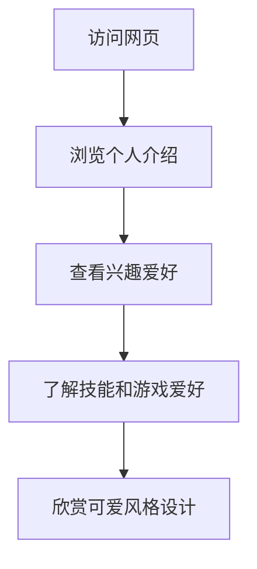

## 1. Product Overview
个人网页展示，用于展示七七大王的个人信息、兴趣爱好和技能。
- 主要目的是创建一个个性化的个人主页，展示个人特色和兴趣爱好
- 目标用户是同学、老师和未来的雇主，展示个人专业背景和兴趣特长

## 2. Core Features

### 2.1 User Roles
| Role | Registration Method | Core Permissions |
|------|---------------------|------------------|
| 访客 | 无需注册 | 浏览所有内容 |

### 2.2 Feature Module
1. **首页**: 个人介绍、兴趣爱好展示、技能展示、游戏爱好展示

### 2.3 Page Details
| Page Name | Module Name | Feature description |
|-----------|-------------|---------------------|
| 首页 | 个人介绍 | 展示姓名、专业、个人简介等基本信息 |
| 首页 | 兴趣爱好 | 展示对AI编程的热情和相关技能 |
| 首页 | 游戏爱好 | 展示喜欢的游戏：洛克王国和王者荣耀 |
| 首页 | 轻松熊元素 | 融入轻松熊IP的可爱风格设计 |

## 3. Core Process
用户访问网页 → 浏览个人介绍 → 查看兴趣爱好 → 了解技能和游戏爱好 → 欣赏可爱风格设计

## 4. User Interface Design
### 4.1 Design Style
- 主色调：粉色、浅蓝色（可爱风格）
- 辅助色：白色、淡紫色
- 按钮风格：圆角、柔和阴影
- 字体：圆润可爱的字体
- 布局风格：卡片式布局，留白充足
- 图标风格：可爱的卡通图标，融入轻松熊元素

### 4.2 Page Design Overview
| Page Name | Module Name | UI Elements |
|-----------|-------------|-------------|
| 首页 | 个人介绍 | 大标题展示姓名，卡片式展示专业和简介，背景有轻松熊元素 |
| 首页 | 兴趣爱好 | 图标+文字展示AI编程热情，使用代码相关的视觉元素 |
| 首页 | 游戏爱好 | 游戏图标展示，洛克王国和王者荣耀的相关视觉元素 |
| 首页 | 轻松熊元素 | 页面各处融入轻松熊的可爱形象，作为装饰元素 |

### 4.3 Responsiveness
- 采用移动端优先的响应式设计
- 在不同屏幕尺寸下自动调整布局
- 触摸优化，确保在移动设备上的良好体验

### 4.4 3D Scene Guidance
- 无需3D场景，使用2D可爱风格设计