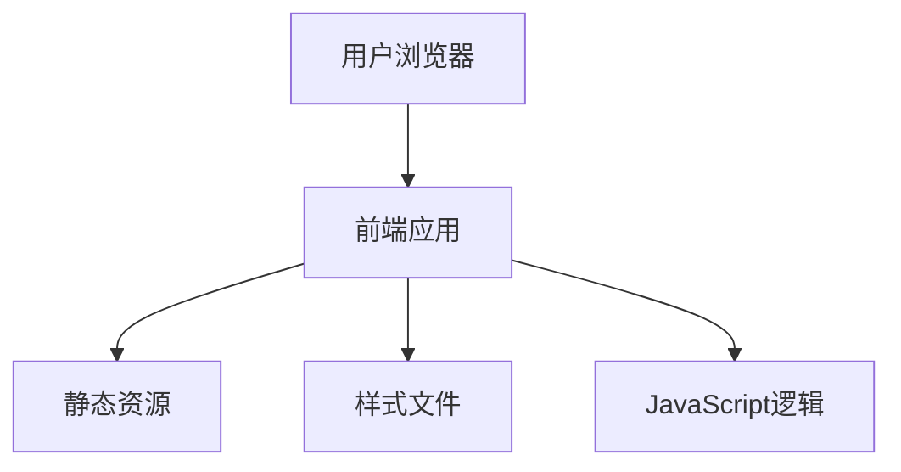

## 1. Architecture Design

## 2. Technology Description
- Frontend: React@18 + tailwindcss@3 + vite
- Initialization Tool: vite-init
- Backend: None (纯前端静态网页)
- Database: None (无需数据库)

## 3. Route Definitions
| Route | Purpose |
|-------|---------|
| / | 首页，展示个人介绍、兴趣爱好、技能和游戏爱好 |

## 4. API Definitions
- 无需API定义，纯静态网页

## 5. Server Architecture Diagram
- 无需服务器架构，纯前端静态网页

## 6. Data Model
- 无需数据模型，纯静态网页